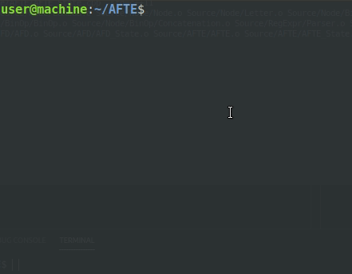

# AFTE
Analizador de Expresiones Rgulares utilizando AFTE's

Ejemplo de gif animado en rchivo Markdown:
<p align="center">
	
</p>

```c++
...
int main(){
	cout << "Hello World" << endl;
	return 0;
}
...
```
