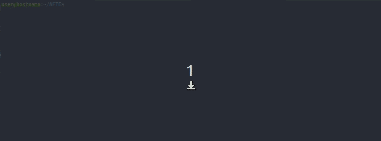
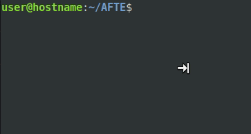
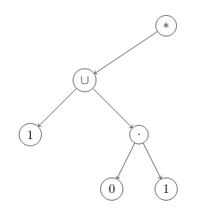
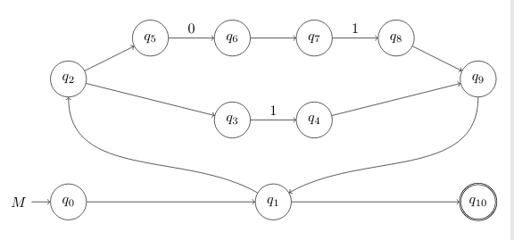
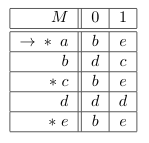

<h1>AFTE</h1>

## Índice de Contenidos 
- [Introducción](#introducci%c3%b3n)
	- [Compilación.](#compilaci%c3%b3n)
	- [Ejecución](#ejecuci%c3%b3n)
	- [Expresiones Regulares](#expresiones-regulares)
- [Opciones Adicionales](#opciones-adicionales)
	- [Árbol de Derivación](#%c3%81rbol-de-derivaci%c3%b3n)
	- [Diagramas de Transicioines Espontáneas](#diagramas-de-transicioines-espont%c3%a1neas)
	- [Tabla de Transiciones](#tabla-de-transiciones)

# Introducción

Este proyecto tiene como objetivo ilustrar el Teorema de Síntesis de Kleene, aplicándolo en la implementación de un programa analizador de expresionees regulares. El teorema afirma lo siguiente:

> #### Teorema de Síntesis de Kleene.
> Sean $\Sigma$ un alfabeto y $A$ una expresión regular sobre $\Sigma$. Existe un Autómata Finito Determinista (AFD) $M$, tal que:
> 
> 	$$ L(M) = A $$
> 
> Es decir, Dada una expresión regular se puede construir un AFD cuyo lenguaje sea igual a dicha expresión regular. 

La demostración de este teorema se utilizó como guía para diseñar e implementar el algoritmo.

---

## Compilación.

Para compilar el programa es necesario tener los compiladores g++ y python, también debe contar con la utilidad 'GNU make' que viene por defecto en los sistemas Linux y Mac, y además requiere de 'git' para clonar este repositorio en su máquina. Si ya cuenta con estas dependencias proceda a clonar el repositorio en su equipo.

```console
user@hostname:~$ git clone https://github.com/fpalaciosFM/AFTE.git 
```

Ya que se encuentre dentro de la carpera ''AFTE'' en su terminal, ejecute makefile:

<p align="center">
	
</p>

---

## Ejecución

El archivo ejecutable tendrá el nombre 'AFTE' en Linux y Mac, y 'AFTE.exe' en Windows. Para ejecutar el programa correctamente es obligatorio introducir una expresión regular como primer parámetro, de lo contrario el programa arrojará una excepción. A continuación verá en su terminal un 'prompt' indicando la espera de una cadena, el programa responderá con un '1' si la cadena ingresada pertenece a la expresión regular, y '0' en caso contrario. La ejecución del programa termina hasta ingresar la cadena 'exit' o al detectar fin de archivo o fin de canal de entrada.

<p align="center">
	
</p>

---

## Expresiones Regulares

Las expresiones regulares pueden contener los siguientes 'tokens':
- lambda
- empty
- 0
- 1
- (
- )
- \*
- \+

El token 'lambda' representa al conjunto cuyo único elemento es la palabra vacía, 'empty' representa al conjunto vacío, 0 y 1 representan los conjuntos que únicamente contienen la palabra '0' y '1' respectivamente, \* representa la cerradura de Kleene, y \+ representa la unión usual de conjuntos. Los paréntesis se utilizan para agrupar expresiones y forzar la prioridad entre las operaciones dentro de estos.

En total se tienen 3 operaciones, en orden de mayor a menor precedencia son:

- Cerradura de Kleene
- Concatenación
- Unión

La cerradura de Kleene de una expresión regular permite reconocer 0 o más repeticiones de esta.
La unión de dos expresiones regulares permite reconocer la coincidencia de por lo menos una de ellas.

Por ejemplo, 0* es la expresión regular formada por la palabra vacía y aquellas palabras que únicamente utilizan 0's como caracteres.
1\*01\* es la expresión regular formada por aquellas cadenas que contienen exactamente un carácter 0 y todos los demás son 1 (en caso de tener más caracteres).
la expresión regular 0+10 contiene únicamente las palabras 0 y 10.

Un ejemplo más interesante podría ser (0\*10\*10\*)\*+000(0+1)*. Esta expresión regular está formada por aquellas palabras que tienen un número par de 1's o que empiezan con 000.

Los espacios se ignoran.

---
# Opciones Adicionales

## Árbol de Derivación

Si desea obtener la representación de una expresión regular en forma de árbol de derivación, simplemente agregue como parámetro 'Tree' (Recuerde que el primer parámetro siempre es la expresión regular).

Por ejemplo, si desea el árbol de derivación de la expresión regular (1+01)*, debe ingresar los siguientes parametros:

```console
user@hostname:~/AFTE$ ./AFTE '(1+01)*' Tree
```

Al ejecutar el comando obtendrá la siguiente salida:

```console\begin{tikzpicture}[nodes={draw, circle}, ->]
\node{$*$}
child{
	node{$\cup$}
	child{
		node{$1$}
	}
	child[missing]
	child{
		node{$\cdot$}
		child{
			node{$0$}
		}
		child{
			node{$1$}
		}
	}
}
child[missing]
child[missing]
child[missing]
;
\end{tikzpicture}

AFTE>> 
```

Se imprime el código Latex del correspondiente arbol de derivación y al final aparece el 'prompt' esperando la entrada de cadenas de texto. Para poder visualizar el arbol debe agregar el paquete 'tikz' en el preámbulo, si además está utilizando el paquete 'babel' tendrá que agrear la librería de tikz 'babel'. A continación se muestra el código latex para imprimir el arbol del ejemplo anterior:

```latex
\documentclass{article}
\usepackage[utf8]{inputenc}
\usepackage[spanish]{babel}
\usepackage{tikz}
\usetikzlibrary{
    babel
}

\begin{document}

    \begin{tikzpicture}[nodes={draw, circle}, ->]
        \node{$*$}
        child{
        	node{$\cup$}
        	child{
        		node{$1$}
        	}
        	child[missing]
        	child{
        		node{$\cdot$}
        		child{
        			node{$0$}
        		}
        		child{
        			node{$1$}
        		}
        	}
        }
        child[missing]
        child[missing]
        child[missing]
        ;
    \end{tikzpicture}

\end{document}
```

El pdf resultante debería mostrar un diagrama parecido al siguiente:

<p align="center">
	
</p>

Se puede ajustar la posición de los nodos agregando o quitando líneas que contengan 'child[missing]'.

---

## Diagramas de Transicioines Espontáneas

Para imprimir el diagrama en Latex del Autómata Finito de Transiciones Espontáneas (AFTE) correspondiente a una expresión regular dada, ingrese la cadena 'AFTE_Diagram' (sin comillas) como parámetro (Recuerde que la expresión regular siempre es el primer parámetro).

Por ejemplo, para obtener el diagrama del AFTE correspondiente a la expresión regular (1+01)*, debe ejecutar el siguiente comando:

```console
user@hostname:~/AFTE$ ./AFTE '(1+01)*' AFTE_Diagram
```

Como salida deberá obtener el siguiente código latex:

```Latex
\begin{tikzpicture}[initial text = $M$]
	\node[state,initial] (0) at (0.000000,0.000000) {$q_{0}$};
	\node[state] (1) at (5.000000,0.000000) {$q_{1}$};
	\node[state,accepting] (10) at (10.000000,0.000000) {$q_{10}$};
	\node[state] (2) at (0.000000,3.000000) {$q_{2}$};
	\node[state] (5) at (2.000000,4.000000) {$q_{5}$};
	\node[state] (6) at (4.000000,4.000000) {$q_{6}$};
	\node[state] (7) at (6.000000,4.000000) {$q_{7}$};
	\node[state] (8) at (8.000000,4.000000) {$q_{8}$};
	\node[state] (9) at (10.000000,3.000000) {$q_{9}$};
	\node[state] (3) at (4.000000,2.000000) {$q_{3}$};
	\node[state] (4) at (6.000000,2.000000) {$q_{4}$};
\path[->]
	(1) edge (10)
	(9) edge[out=-90,in=30] (1)
	(8) edge (9)
	(7) edge[above] node{$1$} (8)
	(6) edge (7)
	(5) edge[above] node{$0$} (6)
	(2) edge (5)
	(4) edge (9)
	(3) edge[above] node{$1$} (4)
	(2) edge (3)
	(1) edge[out=150,in=-90] (2)
	(0) edge (1)
;
\end{tikzpicture}
```

Para poder compilar el código latex debe agregar el paquete 'tikz' y las librerias de tikz 'babel' y 'automata' en el preámbulo:

```Latex
\usepackage{tikz}
\usetikzlibrary{
    automata,
    babel
}
```


El pdf generado deberá mostrar un diagrama como el siguiente:

<p align="center">
	
</p>

---

## Tabla de Transiciones

Para obtener la tabla del Autómata Finito Determinista (AFD) correspondiente a la expresión regular dada, debe ingresar como parámetro 'AFD_Table' al comando (Recuerde que la expresión regular siempre es el primer parámetro):

```console
user@hostname:~/AFTE$ ./AFTE '(1+01)*' AFD_Table
```

Para la expresión regular (1+01)* deberá obtener el siguiente código Latex:

```latex
\begin{tabular}{|r||c|c|}
	\hline
	 $M$ & $0$ & $1$ \\
	\hline
	\hline
	$\rightarrow{} *\;a$ & $b$ & $e$ \\
	\hline
	$b$ & $d$ & $c$ \\
	\hline
	$*\;c$ & $b$ & $e$ \\
	\hline
	$d$ & $d$ & $d$ \\
	\hline
	$*\;e$ & $b$ & $e$ \\
	\hline
\end{tabular}
```

El cual genera la siguiente tabla:

<p align="center">
	
</p>

La flecha indica el estado inicial y los asteriscos indican estados finales. Esta tabla en general no representa al autómata mínimo.