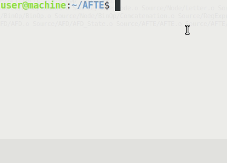

# AFTE

Este proyecto tiene como objetivo ilustrar el Teorema de Síntesis de Kleene, aplicándolo en la implementación de un programa analizador de expresionees regulares. El teorema afirma lo siguiente:

> #### Teorema de Síntesis de Kleene.
> Sean $\Sigma$ un alfabeto y $A$ una expresión regular sobre $\Sigma$. Existe un Autómata Finito Determinista (AFD) $M$, tal que:
> 	$$ L(M) = A $$
> Es decir, Dada una expresión regular se puede construir un AFD cuyo lenguaje sea igual a dicha expresión regular. 

---

## Compilación.

Para compilar el programa debe clonar este repositorio en su equipo.

```console
user@hostname:~$ git clone https://github.com/fpalaciosFM/AFTE.git 
```

Una vez que se encuentre dentro de la carpera ''AFTE'' desde su terminal, ejecute makefile:

<p align="center">
	
</p>

---

## Ejecución

El archivo ejecutable tendrá el nombre 'AFTE' en Linux y Mac, y 'AFTE.exe' en Windows. Para ejecutar el programa correctamente introduzca una expresión regular como primer parámetro. A continuación verá en su terminal un 'prompt' indicando la espera de una cadena, el programa responderá con un '1' si la cadena ingresada pertenece a la expresión regular, y '0' en caso contrario. La ejecución del programa termina hasta ingresar la cadena 'exit' o al detectar fin de archivo o fin de canal de entrada.

<p align="center">
	
</p>

---

## Expresiones Regulares

Las expresiones regulares pueden contener los siguientes 'tokens':
- lambda
- empty
- 0
- 1
- (
- )
- \*
- \+

El token 'lambda' representa al conjunto cuyo único elemento es la palabra vacía, 'empty' al conjunto vacío, 0 y 1 representan los conjuntos que únicamente contienen la palabra '0' y '1' respectivamente, \* representa la cerradura de Kleene, y \+ representa la unión usual de conjuntos. Los paréntesis se utilizan para agrupar expresiones y forzar la prioridad entre las operaciones dentro de estos.

En total se tienen 3 operaciones, en orden de mayor a menor precedencia son:

- Cerradura de Kleene
- Concatenación
- Unión

La cerradura de Kleene de una expresión regular permite reconocer 0 o más repeticiones de esta.
La unión de dos expresiones regulares permite reconocer la coincidencia de por lo menos una de ellas.

Por ejemplo, 0* es la expresión regular formada por la palabra vacía y aquellas palabras que únicamente utilizan 0's como caracteres.
1\*01\* es la expresión regular formada por aquellas cadenas que contienen exactamente un caracter 0 y todos los demás son 1 (en caso de tener más caracteres).
la expresión regular 0+10 contiene únicamente las palabras 0 y 10.

Un ejemplo más interesante podría ser (0\*10\*10\*)\*+000(0+1)*. Esta expresión regular está formada por aquellas palabras que tienen un número par de 1's o que empiezan con 000.

Los espacios se ignoran.


---
---

```console
user@hostname:~/AFTE$ make
```


Ejemplo de gif animado en archivo Markdown:
<p align="center">
	
</p>

```c++
...
int main(){
	cout << "Hello World" << endl;
	return 0;
}
...
```

```console
user@machine:~/AFTE$ make run
./AFTE
1+10.
{
 states:{ q3 q1 q0 q2 },
 initialState: q0,
 finalStates:{ q3 q1 },
 transitions:{
	0	'1':1	'0':2
	1	'1':2	'0':3
	2	'1':2	'0':2
	3	'1':2	'0':2
 }}
user@machine:~/AFTE$ 
```
