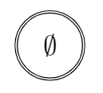

# Nodos

Los nodos se utilizan para representar los árboles de derivación de las expresiones regulares.

Los árboles de derivación son la parte central del proyecto, ya que estos, además de representar las expresiones regulares, nos sirven para generar al AFTE correspondiente y su diagrama de transiciones.

Se definirán tres tipos de nodo final:
- Empty
- Lambda
- Letter

Y tres tipos de nodo binario:
- Concatenation
- Union
- Closure

[//]: # (A continuación se explicarán los detalles de cada nodo final. Para los nodos binarios revise el markdown que se encuentra en la carpeta *BinOp*.)

# Node

`Node` es una clase abstracta que representará a los demás tipos de nodos para formar expresiones regulares en forma de arbol de derivación. Más específicamente representará a los nodos finales. Los nodos binarios serán representados mediante la clase abstracta `BinOp`, que a su vez extiende a la clase `Node`.

El único atributo que tiene la clase `Node` es `texString` de tipo `string`. Esta cadena de texto representa el símbolo que se rotulará en el nodo de la correspondiente instancia de la clase `Node`. Este atributo puede ser una fórmula de LaTeX. Por ejemplo, para el nodo `N` con diagrama:

	

Se tendría  `N.texString = "$\emptyset$"`

## Métodos Básicos

La clase `Node` tiene los siguientes métodos básicos (públicos):

- `int Type()`
- `Node* Copy()`
- `Node* Simp()`

El primero hace uso de la enumeración definida en el archivo `Node.hpp` que consta de las siguientes constantes:

- `LETTER`
- `EMPTY`
- `LAMBDA`
- `UNION`
- `CONCAT`
- `CLOSURE`

Que corresponden a cada tipo de nodo que se utilizará en el proyecto.

El método `int Type()` regresa la constante correspondiente al tipo de nodo de la instancia invocadora.

El método `Node* Copy()` tiene como finalidad devolver un apuntador a una nueva instancia de `Node` con los mismos atributos y apuntando a copias de los nodos hijos del nodo invocador. Para el caso de los nodos finales sólo es necesario hacer copia del atributo `texString`.

El método `Node* Simp()` tiene la finalidad de devolver un apuntador de `Node` de la instancia invocadora pero simplificada. El método de simplificación depende de cada tipo de nodo, pero para los nodos finales simplemente se regresa una copia usando el método `Node* Copy()`.

## Arbol de Derivación

Los métodos que se utilizan para generar el código ``LaTeX`` que representa el arbol de derivación de una expresión regular a partir de la clase `Node` son:

- ``string getTexStr()``
- ``virtual string printTree()``
- ``virtual string printTree(int&)``

``getTexStr`` simplemente devuelve el atributo `texString` del nodo invocador.

El método `printTree()` tiene como finalidad devolver el código ``LaTeX`` de la expresión regular que está representado por el correspondiente nodo invocador. Este método inicia la generación recursiva del código `LaTeX` invocando al método ``printTree(int&)`` con valor inicial `0` como parámetro, el cual cuenta el número de espacios que debe haber entre nodos que se encuentran en el mismo nivel del correspondiente arbol de derivación.

El método `printTree(int&)` obtiene el código `LaTeX` de los nodos hijos del nodo invocador, además de que calcula los espacios entre nodos del mismo nivel en el arbol de derivación correspondiente. Para más detalles revisar el README.md del directorio `BinOp`.

## Diagrama de AFTE

Para la generación del diagrama de transiciones del AFTE se utilizan los siguientes atributos públicos:

- ``double height``
- ``double width``
- ``const double E = 1.0``
- ``const double N = 1.0``

Estos atributos se utilizan para almacenar las dimensiones correspondientes al diagrama de la respectiva instancia de nodo. Los atributos `height` y `width` corresponden a la altura y al ancho del diagrama respectivamente. Las constantes `E` y `N` corresponden al tamaño de las aristas y nodos del diagrama respectivamente.

El método `initDims()` tiene como propósito calcular de forma recursiva las dimensiones de los nodos hijos del nodo invocador y, a partid de estos valores, calcular las dimensionas del nodo invocador.

## Conversión a AFTE

Para la conversión de expresión regular a AFTE se utilizan los siguientes métodos:

- `virtual AFTE toAFTE()`
- `virtual AFTE toAFTE(double x, double y)`

El método `virtual AFTE toAFTE(double x, double y)` genera de forma recursiva al AFTE que representa a los nodos hijos del nodo invocador y a partir de estos se genera el AFTE del nodo invocador.

El método `virtual AFTE toAFTE()` simplemente inicializa la recursividad invocando el método `virtual AFTE toAFTE(double x, double y)` con los valores iniciales `x = y = 0`.