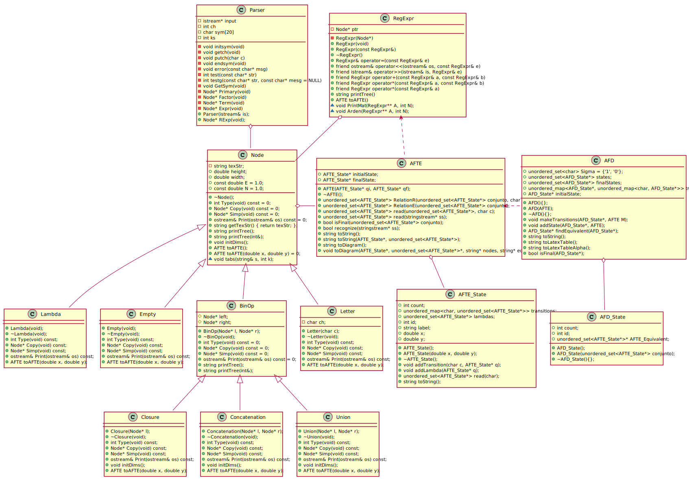

# Nodos

Los nodos se utilizan para representar los árboles de derivación de las expresiones regulares.

Los árboles de derivación son la parte central del proyecto, ya que estos, además de representar las expresiones regulares, nos sirven para generar al AFTE correspondiente y su diagrama de transiciones.

Se definirán tres tipos de nodo final:
- Empty
- Lambda
- Letter

Y tres tipos de nodo binario:
- Concatenation
- Union
- Closure

