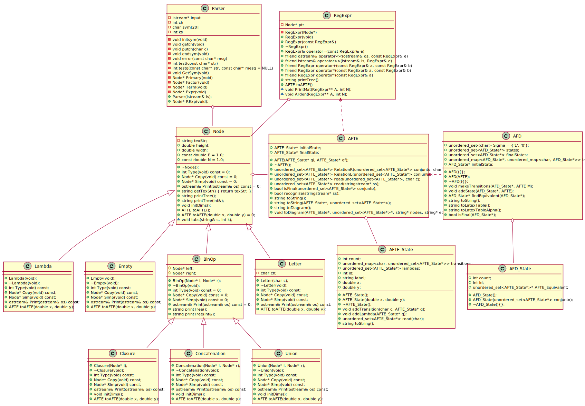

# Proyecto de Reconocimiento de Patrones en Cadenas de Texto (usando expresiones regulares, AFD's y AFTE's)

Este proyecto se compone de 4 partes principales:

- Nodos (Node)
- Expresiones Regulares (RegExpr)
- Autómatas Finitos de Transiciones Espontáneas (AFTE)
- Autómatas Finitos Deterministas (AFD)

Además se agregó una carpeta extra, Misc, donde únicamente se define la función máximo. Esta parte estaba pensada para guardar funciones auxiliares para el proyecto.

Dentro de los directorios correspondientes a cada parte se encuentra un archivo Markdown (como este) con información más detallada sobre el desarrollo de los programas.

A continuación se presenta información general sobre cada parte del proyecto.

# Nodos

# Expresiones Regulares
# Autómatas Finitos de Transiciones Espontáneas
# Autómatas Finitos Deterministas

A continuación se muetra el diagrama de clases completo:

